# Capstone_Research_Assistant_Agent 🤔💻

### 🏆 Capstone Project | Team Exceptional (Group 1)
**Course:** ITAI 2376  
**Authors:** Richard Evans, Nezar Khalfallh, Sufyan Rafiq, Hayden Wood

---
## 📖 Project Showcase

A Python-based agent that performs autonomous web research, evaluates source credibility, and synthesizes summaries using the BART transformer model. It features a hybrid search architecture (DuckDuckGo + Wikipedia Fallback) and a Reinforcement Learning feedback loop to adapt to user preferences.

**The Goal:**
To develop an **Intelligent Agent** that combats information overload by automatically retrieving, evaluating, and synthesizing reputable sources into concise, verified summaries.

See the full report in the **ARCHITECTURE_REPORT.md** file which details the approach to ensure reliability and precision:  

## 🚀 Features
* **Hybrid Retrieval:** Automatically switches between DuckDuckGo and Wikipedia based on availability.
* **Safety Guardrails:** Filters unsafe or prohibited topics.
* **Credibility Scoring:** Rates sources as High/Medium/Low based on domain (.edu, .gov).
* **Adaptive Memory:** Learns user preferences for summary length over time.
* **Gradio UI:** Clean, browser-based interface.

---
### 📊 Key Results

* **Resilient Architecture:** Implemented a "fail-safe" hybrid retrieval strategy that automatically detects search engine blocks and pivots to Wikipedia, ensuring zero downtime during queries.

* **Offline Optimization:** Eliminated "403 Forbidden" API errors and reduced processing latency by migrating from heavy cloud-based transformers to a lightweight, local sumy LSA summarizer.

* **Adaptive Learning:** Demonstrated a functional Reinforcement Learning (RL) loop where user feedback ("Too Long"/"Too Short") successfully updated persistent memory configurations, altering the agent's behavior in subsequent runs.

* **Safe User Experience:** Integrated a Gradio web interface with strict input validation, successfully filtering 100% of prohibited keywords during safety testing.

---
## 🎥 Formal Project Presentation
You can view our full project presentation slides here: 
[**View Portfolio Presentation Slides**](./Deep_Learning_ITAI2376_Portfolio.pptx)

*(Note: Please download the file to view the full PowerPoint)*

---

## 🎥 Live Demonstration & GUI Architecture

The **Graphical User Interface (GUI)** for this agent is built using Gradio, a Python library specialized for Machine Learning demos. The specific implementation is located in `app.py`.

* **Code Reference:** The `with gr.Blocks() as demo:` block in `app.py` defines the layout, buttons, and event triggers.
* **Activity:** When you execute `python app.py`, the script launches a local web server (Client-Server model). By using the `share=True` parameter, it creates a secure tunnel that generates a public URL, allowing you to interact with the agent through your web browser even when it is running on a remote cloud Codespace.


### Data Flow Graph
The following graph illustrates the decision-making process the agent performs during a live request:

```mermaid
graph TD;
    User[User Enters Topic] -->|Input| Safety{Safety Check};
    Safety -->|Unsafe| Block[❌ Request Denied];
    Safety -->|Safe| Search{Try Search Engine};
    
    Search -->|Success| DDG[DuckDuckGo Results];
    Search -->|Fail/Blocked| Wiki[Wikipedia Fallback];
    
    DDG --> Text[Raw Text Data];
    Wiki --> Text;
    
    Text -->|Summarize| Sumy[LSA Summarizer];
    Sumy -->|Format| Report[📝 Final Report];

```


---
## 🛠️ Installation & Running Instructions

1.  **Clone the Repository**
    ```bash
    git clone [https://github.com/DrahcirSnave/research-agent.git](https://github.com/DrahcirSnave/research-agent.git)
    cd research-agent
    ```

2.  **Install Dependencies**
    It is recommended to use a virtual environment.
    ```bash
    pip install -r requirements.txt
    ```

3.  **Run the Web Interface**
    Run the application using the following command:
    ```bash
    python app.py
    ```

4.  **Access the GUI**
    The terminal will display two URLs. Choose the one that works for your setup:
    * **Local URL:** `http://127.0.0.1:7860`  
        *(Try this first—works for standard setups)*
    * **Public URL:** `https://<random-id>.gradio.live`  
        *(Use this if the local link refuses to connect)*

## 📂 Project Structure
* `app.py`: The Gradio user interface.
* `agent_logic.py`: The brain of the agent (Search, Summarize, Plan).
* `utils.py`: Helper functions for memory and safety.
* `config.json`: Default configuration settings.
* `docs/`: Detailed architectural documentation.
